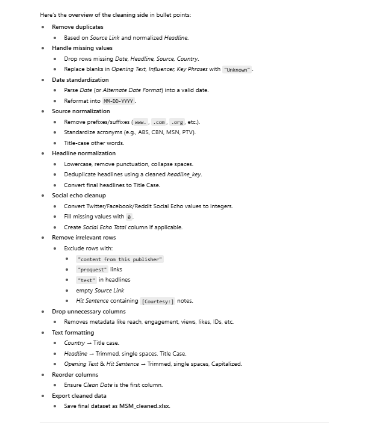

# Media Monitoring Data Cleaning and Analysis

A reproducible Python project for splitting, cleaning, and analyzing media-monitoring exports from the Presidential Communications Office (PCO). It separates records into mainstream media (MSM) and social media (SM), applies standardized cleaning rules, and exports analysis-ready Excel files.



## Repository structure

```text
media-monitoring-cleaning/
├── data/
│   ├── raw/PCO.xlsx
│   └── processed/
├── docs/cleaning-overview.png
├── notebooks/
│   ├── MSM_analysis.ipynb
│   └── SM_analysis.ipynb
├── src/clean_media_data.py
├── requirements.txt
└── README.md
```

## Cleaning workflow

The pipeline:

- Splits the original workbook into MSM and SM records.
- Removes duplicates using `Source Link` and a normalized headline key.
- Handles missing values and fills selected text fields with `Unknown`.
- Parses and standardizes dates to `MM-DD-YYYY`.
- Normalizes source names and common acronyms.
- Converts social-echo fields to integers and calculates `Social Echo Total`.
- Removes irrelevant rows, ProQuest links, test headlines, blank links, and courtesy-only hit sentences.
- Drops unnecessary metadata columns.
- Standardizes text formatting, key phrases, countries, and languages.
- Exports `MSM_cleaned.xlsx` and `SM_cleaned.xlsx`.

## Setup

```bash
python -m venv .venv
source .venv/bin/activate        # Windows: .venv\Scripts\activate
pip install -r requirements.txt
```

## Run the cleaning pipeline

From the repository root:

```bash
python src/clean_media_data.py data/raw/PCO.xlsx --output-dir data/processed
```

Expected outputs:

```text
data/processed/MSM.csv
data/processed/SM.csv
data/processed/MSM_cleaned.xlsx
data/processed/SM_cleaned.xlsx
```

## Run the notebooks

```bash
jupyter notebook
```

Open either notebook in `notebooks/`. Update file paths to point to `data/processed/` when needed.

## Data note

The included workbook is the source file supplied for this project. Before publishing the repository publicly, confirm that the dataset does not contain confidential, personal, or licensed information. For a public repository, consider removing `data/raw/PCO.xlsx` and adding only a small anonymized sample.

## Suggested GitHub description

> Python pipeline and Jupyter notebooks for cleaning, splitting, and analyzing mainstream and social media-monitoring data.
